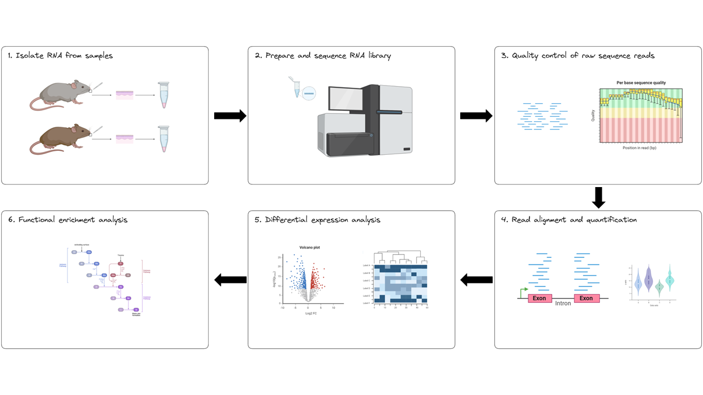
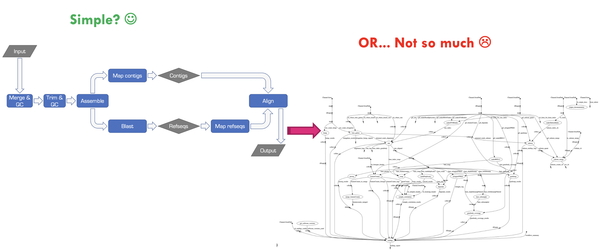
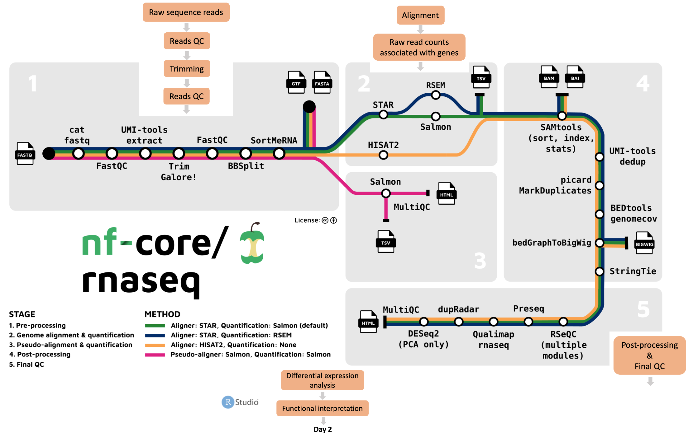
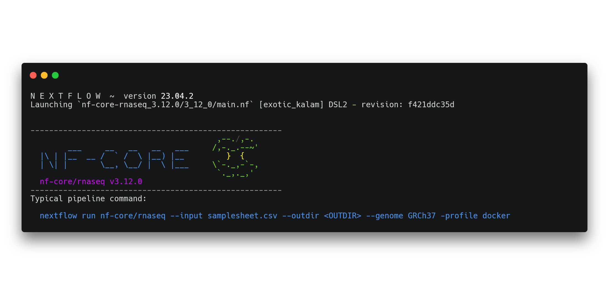

# **Intro to the workflow**

Learning objectives: 
* Understand the basic RNAseq DE data processing and analysis workflow 
* Understand why Nextflow and nf-core are good options for reproducible and portable bioinformatics workflows
* Understand in which situations the CLI is a suitable environment for RNAseq analysis 
* Understand the nf-core/rnaseq pipeline structure 
* Identify the default and required nf-core/rnaseq parameters

RNAseq workflow
* Data processing (day 1) and analysis (day 2)
* Explain the RNAseq-DE workflow and which stage we are starting day 1 at 
* Explain [nf-core/rnaseq structure](https://sydney-informatics-hub.github.io/rna-seq-pt1-quarto/notebooks/2.1_nfcore-rnaseq.html#what-tools-and-processes-does-the-pipeline-run)

Nextflow and nf-core 
* Explain why we are using nf-core and working on CLI 
* Take some details re: workflow management systems from [here](https://sydney-informatics-hub.github.io/rna-seq-pt1-quarto/notebooks/2.0_intro_to_nextflow_and_nfcore.html)
* Discuss nf-core params, tools, pipelines, documentation. As per the [customising nf-core workshop](https://sydney-informatics-hub.github.io/customising-nfcore-workshop/notebooks/2.1_design.html)

Activities
* Create sample sheet?
* Run help command 

# Materials draft

## **What is RNAseq?** 

RNAseq experiments involve the collection of RNA from a tissue of interest, converting this raw biological material to a digitised format using a high-throughput sequencing platform, pre-processing the resulting raw sequence reads so they can then be analysed to identify differentially expressed genes and functional pathways.

Using this technique, we can measure gene expression at the transcriptome level by: 

1. First, capturing a representative sample of mRNA in our samples, then
2. Aligning sequence reads to a reference genome, then  
3. Identifying the number of sequence reads that are aligned to each gene, then  
4. Applying statistical methods to capture the variance and significance in gene expression levels across different conditions or groups of samples. 

This method allows for the identification of upregulated or downregulated genes, giving insights into the biological processes and molecular functions that are active in the tissue being studied. In this workshop, by comparing the expression levels of genes between knock-out and wild type mice, it is possible to identify the molecular mechanisms underlying WBS and potentially discover targets for therapeutic intervention.

## **RNAseq experimental workflow** 

The experimental workflow for RNAseq is presented in the image below. It consists of six steps: 

1. **Isolate RNA from samples**  
2. **Prepare and sequence the RNA**
3. **Perform quality control of raw sequence reads**
4. **Align sequence reads to a reference genome and count the number of reads mapped to each gene**
5. **Apply statistical methods to capture variance and significance between groups**
6. **Identify which biological processes, components, and functions are over-represented**



## **RNAseq data processing pipeline** 

In the first session/day of this workshop, we will be performing steps 3 and 4 of the experimental workflow above. We will then analyse our processed data in the second session/day of the workshop, following steps 5 and 6. To process our data on day 1 we will be: 

* Working on the command-line interface 
* Working with the raw sequence data from the Corley et al. (2016) case study
* Running the [nf-core/rnaseq](https://nf-co.re/rnaseq/3.12.0) pipeline 

### **Why are we running a pipeline?** (put this in an info box)

Bioinformatics workflows are like wet-lab protocols, they consist of many steps that need to be performed consistently across experiments. And just like wet-lab protocols, things can get very complicated very quickly when we’re working with different numbers of samples, different organisms, and collaborating with other researchers. Just take a look at the image below to see how messy things can get! 



Bioinformatics workflows, especially those required to process next generation sequence (NGS) data (like RNAseq), can be very repetitive. At the scale that biological data is growing, computational workflows are a great solution for performing these repetitive, tedious tasks.

### **What is nf-core/rnaseq?**

nf-core is a community-curated collection of bioinformatics pipelines written in [Nextflow](https://www.nextflow.io). The nf-core community is global, comprising bioinformaticians, computational biologists, software engineers, and biologists. The community works together to develop and maintain best practice bioinformatics pipelines and support others in running them. They’ve also developed a toolkit to assist in pipeline usage and development. Everyone is welcome to join the community! 

The [nf-core/rnaseq](https://nf-co.re/rnaseq/3.12.0) pipeline can be used to analyse RNA sequencing data obtained from organisms with a reference genome and annotated gene dataset. It is flexible and modular, allowing users to choose which processes to run and giving users the choice of different tools for essential steps like read alignment.

### **What can nf-core/rnaseq do?** 

Users can run their data through the whole pipeline with one command, or specific stages. The nf-core/rnaseq workflow comprises 5 stages:

1. Raw data pre-processing and quality control using FastQC, MultiQC and Trim Galore!
2. Genome alignment and quantification using a choice of STAR, RSEM, or HISAT2
3. Pseudo-alignment and quantification with Salmon
4. Post-processing of aligned sequences including indexing, removal of duplicate reads, and transcript assembly and quantification
5. Final quality control for evaluating alignment and quantification results.

Looking at the nf-core/rnaseq pipeline structure below, we can see that the developers have:

* Organised the workflow into 5 stages based on the type of work that is being done
* Provided a choice of multiple methods and specified defaults
* Provided a choice of tool for some steps



### **Where can I run the pipeline?** (put this in an info box)

Given Nextflow’s focus on portability and reproducibility, the [nf-core/rnaseq](https://nf-co.re/rnaseq/3.12.0) pipeline can be run on any compute environment where you can install Nextflow and one of the software management tools like Singularity, Docker, or Conda (among others). Take a look at their [installation guide](https://nf-co.re/docs/usage/installation#nextflow) for more details.

Keep in mind that each of the tools the [nf-core/rnaseq](https://nf-co.re/rnaseq/3.12.0) pipeline uses has its own minimum compute resource requirements. This means you’ll need to make sure the environment you’re working on has enough RAM and CPUs to process your data and disk space to store your raw data, intermediate files, and final results. 

Given how greedy these processes can be, we usually recommend you don’t work on your personal computer. Today, we’re working on Pawsey’s Nimbus cloud which is accessible to all Australian researchers. You might also consider other national high performance computing (HPC) platforms, your institution’s HPC, as well as commercial cloud offerings.

### **Get familiar with your environment**

Let's take a look at our home directory on the command-line on your Nimbus instance. Ensure you are in your home directory by running: 

```bash
pwd
```
```bash
/home/training
```

If you are not in `/home/training`, move there by running:

```bash
cd ~
```

From your home directory, run the following command: 

```bash
ls -lah
```

```bash
drwxrwxr-x 5 training training 4.0K Sep 29 03:15 .
drwxrwxr-x 6 training training 4.0K Sep 19 03:27 ..
drwxrwxr-x 2 training training 4.0K Sep 29 02:14 Data
drwxrwxr-x 2 training training 4.0K Sep 29 02:14 Day_1
drwxrwxr-x 3 training training 4.0K Sep 29 03:15 Day_2
```

All the files necessary to run today's exercises have already been prepared for you and saved to the `Data` directory. 
We will be using the `Day-1` materials in the `Data` directory (`~/Data/Day-1`) today. Take a look at its contents by running: 

```bash
ls Data/*
```

It contains the following:  

* `samplesheet.csv`
* Reference genome (fasta) and indexes 
* Fastq files 
* Back-up qc run results 
* Back-up full run results 

Now, move into the `Day_1` directory: 

```bash
cd Day_1
```

You will do all your work from here today.  

Next, take a look at the contents of the `Day_1` directory: 

```bash
ls -lah 
```
```bash
drwxrwxr-x 5 training training 4.0K Sep 29 03:15 .
drwxrwxr-x 6 training training 4.0K Sep 19 03:27 ..
drwxrwxr-x 3 training training 4.0K Sep 29 03:15 nf-core-rnaseq_3.12.0
```

### **Get familiar with the nf-core/rnaseq run command**

You can see the recommended (typical) run command and all the parameters available for the [nf-core/rnaseq](https://nf-co.re/rnaseq/3.12.0) pipeline either at [their parameters page](https://nf-co.re/rnaseq/3.12.0/parameters/) or by running:

```bash
nextflow run nf-core-rnaseq_3.12.0/3_12_0/main.nf --help 
```



Look at all the different parameters! We won't be using most of these today as we'll be running the default workflow. 

Now that we are familiar with our working space, we are going to run the [nf-core/rnaseq](https://nf-co.re/rnaseq/3.12.0) pipeline in two stages: 

1. Raw data quality control 
2. Alignment and quantification 

The mouse genome is large and contains ~20,000 genes which would take hours to process. For the sake of expediency, we are running the pre-processing workflow on a subset of the whole mouse genome for both of these stages. Tomorrow we will provide you with a whole genome count matrix, to perform differential expression and enrichment analyses. 