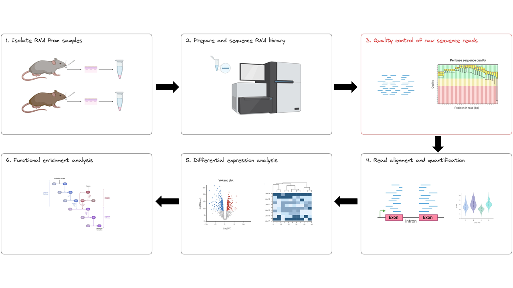
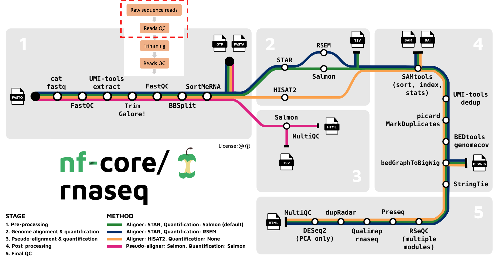
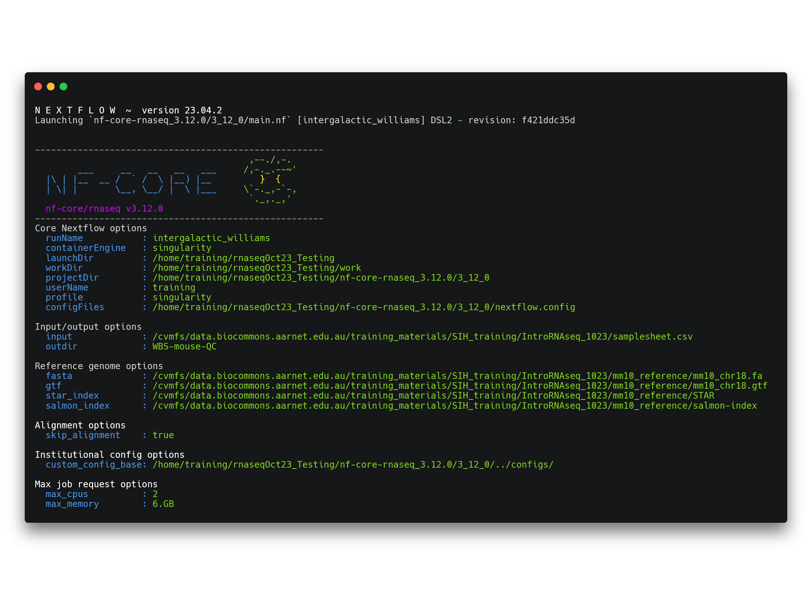
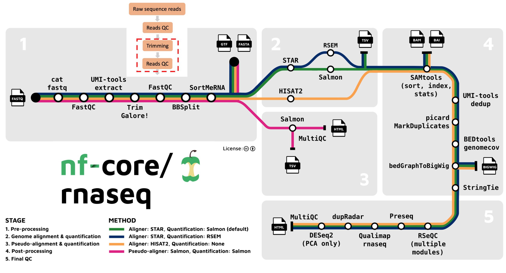

# **RNAseq data quality control and trimming**

Learning objectives: 
* Understand how to apply parameters to an nf-core pipeline to cusomise its execution
* Understand the fastq file format 
* Learn how to interpret a FastQC report for RNAseq data 
* Learn about the benefits and drawbacks of read trimming for RNAseq-DE

Breakout rooms:
* Pre-trim fastQC report questions
    * How many sequences in one sample fq?
    * How long are sequence reads? 
    * Which part of the reads has the worst quality? 
    * Is this a good dataset? Why or why not?
    * Solutions to improve the quality? 
* Post-trim QC 
    * Which tool was used for trimming? 
    * Which tool generated quality reports before and after trimming?
    * What effect did trimming have? 

# Materials draft

We’re starting at the first bioinformatics stage of the RNAseq workflow, specifically with raw data QC step (red box below). 



This step corresponds to the first part (red box) of the nf-core/rnaseq pipeline.



### What is fastq format? (call out block)

When your data is sequenced, it will be output in the fastq format by the sequencing machine. Fastq is a text-based format for storing both a biological sequence (usually nucleotide sequence) and it’s corresponding quality score. Each entry in a fastq file will consist of 4 lines:

* A sequence identifier (label)
* The nucleotide sequence
* A separator line, usually just a plus (+) sign
* The base call quality (phred) score per nucleotide

Phred quality scores are used to indicate the quality of a base call. The Phred score corresponds to the probability that the base was called correctly. Take a look at GATK’s explanation of Phred scores for more information.

## **Run the qc command**

In any bioinformatics experiment, it is crucial that you perform quality control (QC) on your data before you process it. Why?

* Identify issues that may interfere with analysis and interpretation 
* Detect biases which may have been introduced during library preparation or sequencing 

nf-core/rnaseq provides users the option to run FastQC and read trimming only. We will do this use the `--skip_alignment` flag/parameter. Using this flag will run 3 steps in the workflow: 

1. Check quality of raw sequence reads for each sample with FastQC
2. Perform raw read trimming with trim galore! 
3. Check quality of trimmed reads for each sample with FastQC
4. Output a MultiQC report 

Run the following command to perform the QC steps above: 

```bash
nextflow run nf-core-rnaseq_3.12.0/3_12_0/main.nf \
    --input samplesheet.csv \
    --outdir WBS-mouse-QC \
    --fasta ~/Data/mm10_reference/mm10_chr18.fa \
    --gtf ~/Data/mm10_reference/mm10_chr18.gtf \
    --star_index ~/Data/mm10_reference/STAR \
    --salmon_index ~/Data/mm10_reference/salmon-index \
    -profile singularity \
    --skip_alignment \
    --max_memory '6.GB' \
    --max_cpus 2
```

Once the pipeline has been executed with the run command, you will see a message printed to the screen. This message contains a summary of the parameters you have used to execute the workflow. 



In addition to this you will see a number of processes spawn out from the workflow. Your screen will progressively update as these tasks are completed. Once they have all finished, a completion message will be printed to your screen: 

```bash
-[nf-core/rnaseq] Pipeline completed successfully -
Completed at: 29-Sep-2023 09:17:28
Duration    : 2m 31s
CPU hours   : 0.1
Succeeded   : 19
```

## **Evaluate the data quality**

Take a look at the output that is produced by your qc run: 

```bash
ls WBS-mouse-QC
```
```bash
fastqc  multiqc  pipeline_info  trimgalore
```

We have 4 directories within our output directory. Using the File Explorer on VS code, open the `WBS-mouse-QC` directory and download the multiqc report `multiqc/multiqc_report.html` to your computer. This MultiQC report aggregates raw and trimmed data FastQC reports for each sample. Open this file in your web browser and answer the questions below.

### Callout box: Exercise 1: raw data qc 

Looking at the Fastqc (raw) section of the MultiQC report: 

1. How many unique and duplicate reads are in `SRR3473989.fastq`?
    * A: 35,519 and 24,368
2. What might be a reason for the high proportion of duplicate reads in this dataset? 
    * A: RNAseq only captures transcripts, therefore the chances of observing duplicate reads is elevated.
3. Take a look at the Per Base Sequence Content plot for all samples. Which part of the reads tend to have worse per base sequence quality? 
    * Reads which tend to have worse per base sequence quality are towards the right hand side (3’ end).
4. Do you think this dataset is of ‘good’ quality? Why or why not? 
    * The color coding separates out regions of good quality (Red PhredQ > 28) from the rest. Overall yes, as most of the regions of the reads show quality values in red.
5. Any suggestions to improve the quality of our raw reads?
    * We can trim the bases towards the 3’-end and hope to improve the overall read-quality. But trimming by quality for RNA-seq data has its pros and cons. 

### Callout box: Exercise 2: fastqc for rnaseq  

FastQC was designed for whole genome sequencing (WGS) and not RNAseq experiments. With this knowledge, can you identify why some categories might have been marked as “fail” or “warn” by looking at the HTML reports?  
* Per-base sequence content fails. Per sequence GC content, sequence duplication levels, and overrepresented sequences return warnings.  
* Per-base sequence content fails because we always see bias at the start of RNA-seq reads, which tells us the random priming is not ‘truly random’. See here for a nice explanation of this.  
* Per sequence GC content, sequence duplication levels, and overrepresented sequences return warnings are received for this same reason.  
* Given there is much less RNA sequence then DNA in our bodies, we don’t observe these biases in WGS.  
* By chance, RNA will be fragmented at the same spot and sequenced multiple times. For DNA, the purpose of these plots is to check for technical bias (optical duplicates - when the sequencer reads the same strand multiple times).

## **Read trimming**

Trimming is sometimes performed to improve the quality of the raw data and potentially improve its mapability when it is being aligned to a reference genome. There are several ways to perform trimming:

* Removal of poor quality reads or bases (e.g. ends of reads)
* Removal of adapter sequences
* Removal of polyA tails

The nf-core/rnaseq pipeline uses Trim Galore for read quality trimming. It is able to perform quality-based removal of low-quality bases and adapter trimming. Given trimming can result in some reads being significantly shortened (sometimes to 0bp!), Trim Galore will filter reads that are too short to be used in downstream processes like read alignment. 

### **Does trimming help?**

Read trimming is not always a necessary step when processing next generation sequencing (NGS) data. These days, NGS data is of a very high quality and the tools we use to perform processes like read mapping are capable of handling poor quality reads and adapter sequences.

While the trimming adapter sequences has been shown to increase the quality of RNA-seq data (Dozmorov et al., 2015), other studies have shown that trimming of poor quality reads can effect gene expression estimates (Williams at el., 2016).

When making the decision to trim your reads for differential expression RNAseq studies, we suggest following the recommendations of the read alignment tool you’ll be using. We will explore trimming outcomes. We are still looking at the outputs from the first part of the nf-core/rnaseq workflow below (red box).



Open your Nimbus terminal again to do the challenge exercise below. Navigate to the results directory `~/Day1/WBS-mouse-QC` either on the command line or using your VS Code File Explorer and answer the following questions:

```bash
cd ~/Day1/WBS-mouse-QC
```

1. Which tool does nfcore-rnaseq use for read-trimming?
    * Trim-galore is used for trimming.
2. Which tool did you use to generate quality reports before and after trimming?
    * FastQC generates `.html` reports.
3. What effect did trimming have on SRR3473989.fastq?
    * Open trimgalore report: `cat trimgalore/SRR3473984.fastq.gz_trimming_report.txt`
    * You can also view the MultiQC report
    * Total sequences has reduced after trimming. Read length is now 21 - 101. Per base sequence quality now mostly in the green

### Key takeaways 

* Quality control is fundamental in RNAseq experiments to identify any issues that might skew analysis and interpretation. 
* The Fastq file format is the primary format used for raw sequencing data. Each entry in a Fastq file has a sequence identifier, the nucleotide sequence itself, a separator, and a base call quality score (Phred score) for each nucleotide.
* Read trimming is a process where certain portions of the raw sequence data are removed to enhance its quality and improve its mappability during alignment. The decision to trim reads in an RNAseq experiment should be based on the recommendations of the alignment tool used and the quality of your data.