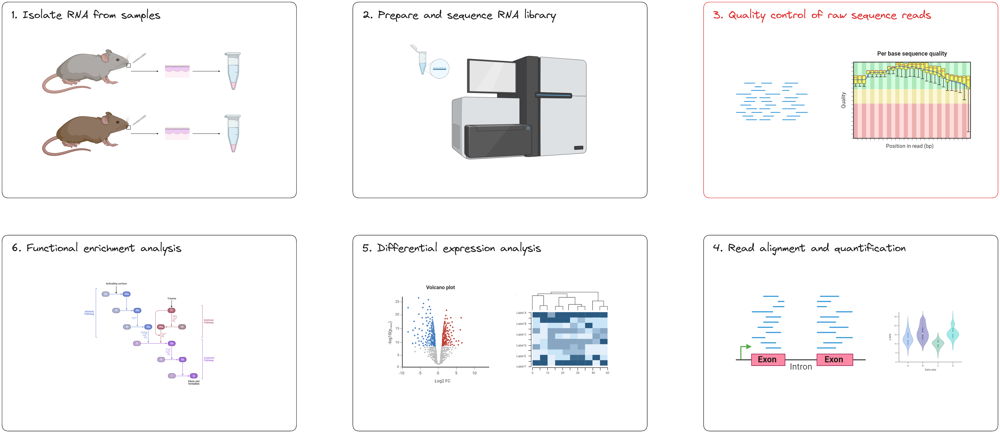

# **RNAseq data quality control**

Learning objectives: 
* Understand how to apply parameters to an nf-core pipeline to cusomise its execution
* Understand the fastq file format 
* Learn how to interpret a FastQC report for RNAseq data 
* Learn about the benefits and drawbacks of read trimming for RNAseq-DE

Breakout rooms:
* Pre-trim fastQC report questions
    * How many sequences in one sample fq?
    * How long are sequence reads? 
    * Which part of the reads has the worst quality? 
    * Is this a good dataset? Why or why not?
    * Solutions to improve the quality? 
* Post-trim QC 
    * Which tool was used for trimming? 
    * Which tool generated quality reports before and after trimming?
    * What effect did trimming have? 

# Materials draft

We’re starting at the first bioinformatics stage of the RNAseq workflow, specifically with raw data QC step (red box below). 



This step corresponds to the first part (red box) of the nf-core/rnaseq pipeline. [Update this image to include trimming!]


### What is fastq format? (call out block)

When your data is sequenced, it will be output in the fastq format by the sequencing machine. Fastq is a text-based format for storing both a biological sequence (usually nucleotide sequence) and it’s corresponding quality score. Each entry in a fastq file will consist of 4 lines:

* A sequence identifier (label)
* The nucleotide sequence
* A separator line, usually just a plus (+) sign
* The base call quality (phred) score per nucleotide

Phred quality scores are used to indicate the quality of a base call. The Phred score corresponds to the probability that the base was called correctly. Take a look at GATK’s explanation of Phred scores for more information.

## **Run the qc command**

In any bioinformatics experiment, it is crucial that you perform quality control (QC) on your data before you process it. Why?

* Identify issues that may interfere with analysis and interpretation 
* Detect biases which may have been introduced during library preparation or sequencing 

nf-core/rnaseq provides users the option to run FastQC and read trimming only. We will do this use the `--skip_alignment` flag/parameter. Using this flag will run 3 steps in the workflow: 

1. Check quality of raw sequence reads for each sample with FastQC
2. Perform raw read trimming with trim galore! 
3. Check quality of trimmed reads for each sample with FastQC
4. Output a MultiQC report 

Run the following command to perform the QC steps above: 

```bash
nextflow run nf-core-rnaseq_3.12.0/3_12_0/main.nf \
    --input ~/Data/samplesheet.csv \
    --outdir WBS-mouse-QC \
    --fasta ~/Data/mm10_reference/mm10_chr18.fa \
    --gtf ~/Data/mm10_reference/mm10_chr18.gtf \
    --star_index ~/Data/mm10_reference/STAR \
    --salmon_index ~/Data/mm10_reference/salmon-index \
    -profile singularity \
    --skip_alignment \
    --max_memory '6.GB' \
    --max_cpus 2
```

## **Evaluate the data quality**

### Exercise 1: raw data qc 

How many sequences in one sample fq?
How long are sequence reads? 
Which part of the reads has the worst quality? 
Is this a good dataset? Why or why not?
Solutions to improve the quality? 

### Exercise 2: trimmed data qc  

Which tool was used for trimming? 
Which tool generated quality reports before and after trimming?
What effect did trimming have? 
