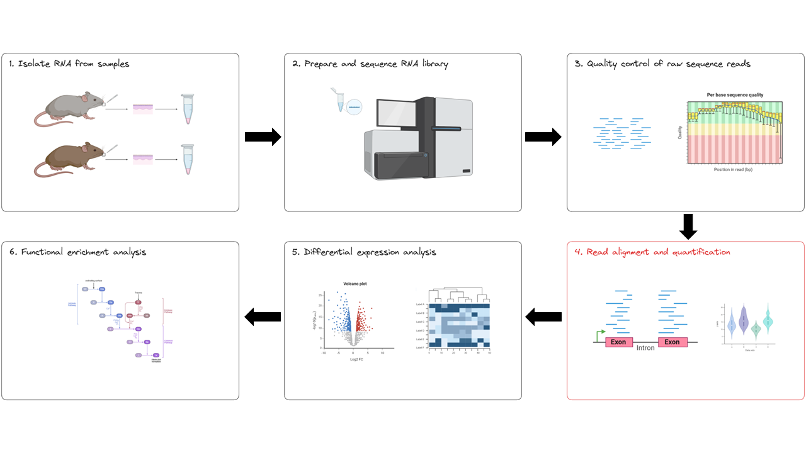
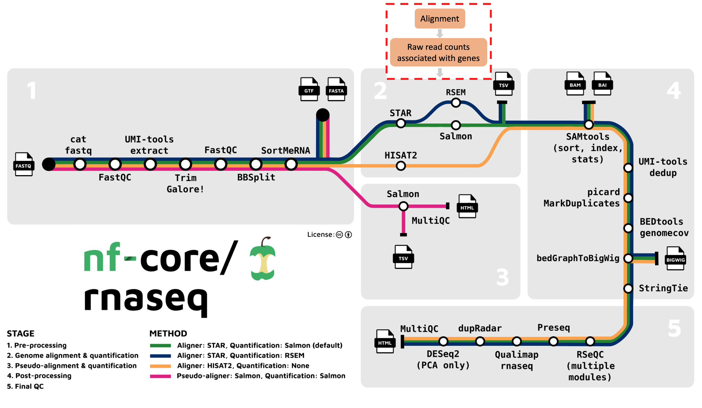
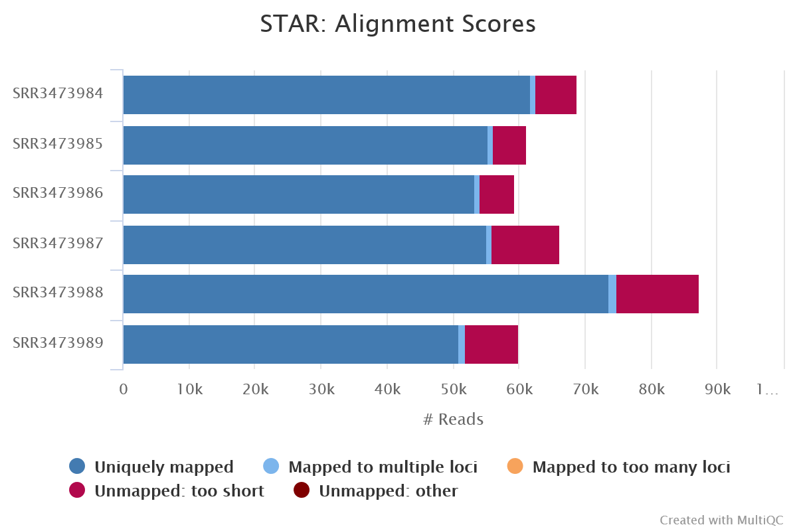
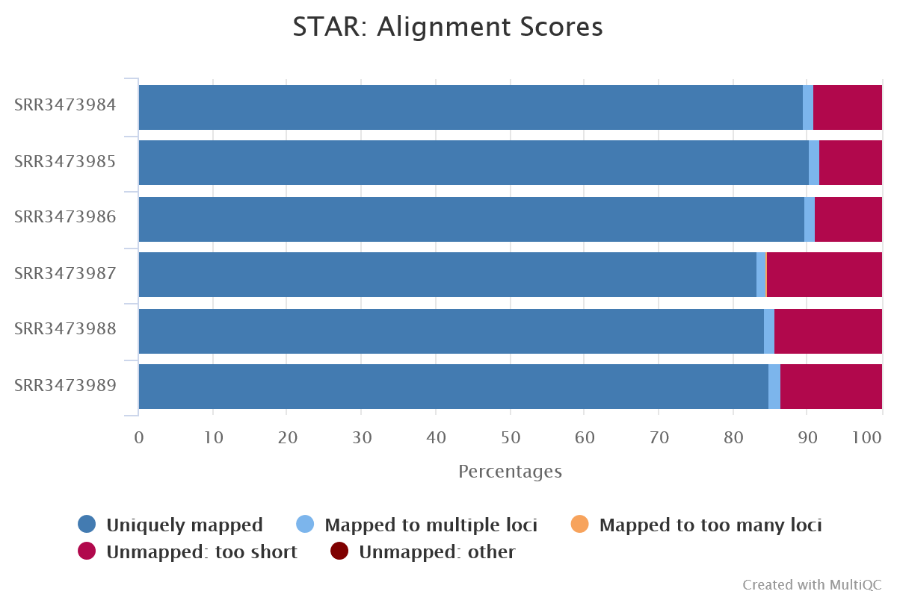

## **Explore outputs**

Learning objectives: 
* Understand the process of mapping sequencing reads to a reference genome in a splice-aware manner 
* Understand how mapped reads are used to quantify gene counts 
* Learn how to read a MultiQC report 

Breakout rooms: 
* Read alignment and quantification 
    * Mislabelled sample exercise KO/WT 
    * Explore the count matrix 

Activities 
* MultiQC report poll questions 

# Materials draft

In this lesson we will explore the outputs of the nf-core/rnaseq pipeline in depth, looking specifically at the results of read alignment and quantification (red box below). 




## **Alignment of reads to a reference genome**

We’ve moved on to the second stage of the nf-core/rnaseq workflow: read alignment and quantification (red box below).



After read trimming, the nf-core/rnaseq pipeline maps reads to a reference genome specified by the user. Keep in mind that RNAseq specific alignment tools are different from whole genome alignment tools. They are designed to be ‘splice aware’, meaning they are capable of differentiating intronic from exonic regions in the alignment process.

Bulk RNA-seq reads are derived from mature mRNA and contain only exons (and no introns). This means a sequence read can span 2 exons. Splice-aware aligners use a reference genome, not a transcriptome to perform read alignment, which contain intergenic, intronic and exonic sequences. This means that when they’re aligned to the reference genome, RNA-seq reads might span large introns. Splice aware aligners know not to align the RNA-seq reads to introns and can align a read across exons.

### Callout block: Genetics 101 refresher: mRNA splicing 

mRNA splicing is the process by which an mRNA transcript prepares to be translated into an amino acid sequence. It works by removing introns and splicing all exons back together to create a mature mRNA that is transported from the nucleus to the cytoplasm, ready to undergo translation.

----

The nf-core/rnaseq pipeline offers us various alignment and quantification routes:

* STAR – Salmon
* STAR – RSEM
* HISAT2 – no quantification

Aligned sequences for each sample are output in the [bam file format](https://en.wikipedia.org/wiki/BAM_(file_format)). 

The nf-core/rnaseq pipeline has been written in a way where all the files generated from the alignment step onwards (except the summary report) are saved to the same directory as specified by `--aligner`. In our case, you will find these files in `star_salmon`.

### Exercise 1: 

In breakout rooms, your facilitator will demonstrate how we can visualise alignments using a tool called IGV. This is a hard one! Thinking back to the case study, can you work out how you would handle the scenario below?

Oh no! We have forgotten to label the conditional groupings of our samples and we don’t know which samples belong to the wildtype or knockout groups!

Can we use the alignment files to assign samples to their correct treatment group?

A: From the case study, we know a loss of function mutation of Gtf2ird1 was generated by an insertion of a Myc transgene, resulting in a 40 kb deletion surrounding exon 1.
* Navigate to the gene in the mm10 assembly (chr5:134332897-134481480)
* Samples SRR3473984, SRR3473985, SRR3473984 contain reads covering exon 1. These are Wildtype samples.
* Samples SRR3473987, SRR3473988, SRR3473989 DO NOT contain reads covering exon 1. These are Knockout samples.

## **Read quantification**

Following read alignment, the nf-core/rnaseq pipeline uses the bam files to calculate raw gene-count data for each sample. We can then use these count files (called a gene-count matrix), to identify differentially expressed genes. By default, the nf-core/rnaseq pipeline runs Salmon for transcript quantification, following alignment by STAR.

STAR (Spliced Transcript Alignment to a Reference) is a very popular RNAseq alignment tool. It has previously been shown to be more accurate and efficient than other popular RNAseq alignment tools. 

Salmon is another popular RNAseq tool, it can take a set of target transcripts to perform quantification. 

Let's take a look at how our aligner and quantification tools performed. Take a look at the alignment scores in the MultiQC summary report generated by the pipeline, you'll find it at:

```bash
/home/training/Day-1/WBS-mouse-results/multiqc/star_salmon/multiqc_report.html
```





As expected, our alignments performed well. Most of the reads in all of our samples were uniquely mapped to the mouse reference genome and only small proportion were unmapped. 

### Exercise 2: 

1. Can you identify the per sample gene count files produced by STAR and Salmon?
    * A: You will see per sample salmon quant output files in sample directories, e.g results > star_salmon > SRR3473989 > quant.sf (transcript level) and quant.genes.sf (gene level). Columns of these files are described in the Salmon documentation. Note - raw counts is not a simple count of depth of reads, there is a lot more to consider and each tool does this slightly differently (e.g. how do you count reads spanning overlapping exons across two different genes?). See the Salmon documentation for how Salmon does it - this count is an estimation.
2. Can you identify the final gene count matrix created by STAR and Salmon?
    * A: A count matrix file (tab separated values or TSV format) is also produced by the workflow. This looks very similar to what we will use in the next session of this workshop. It can be found here: results > star_salmon > salmon.merged.gene_counts.tsv. Most genes will have 0 counts because we subset the data.

### Key takeaways 

* A variety of methods for read alignment and transcript quantification are available in the nf-core/rnaseq pipeline.
* Splice aware alignment tools like HISAT2 and STAR must be used when aligning RNA-seq reads to a reference genome.
