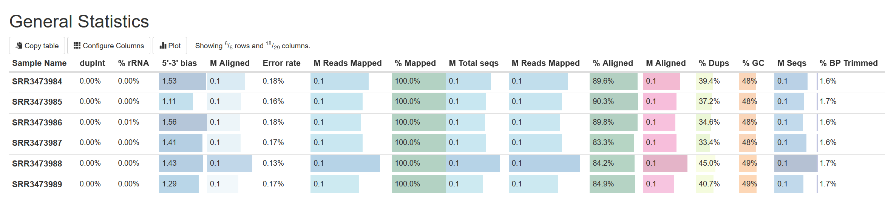
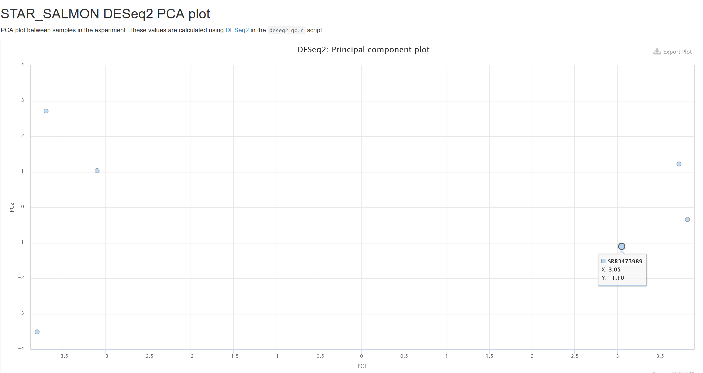
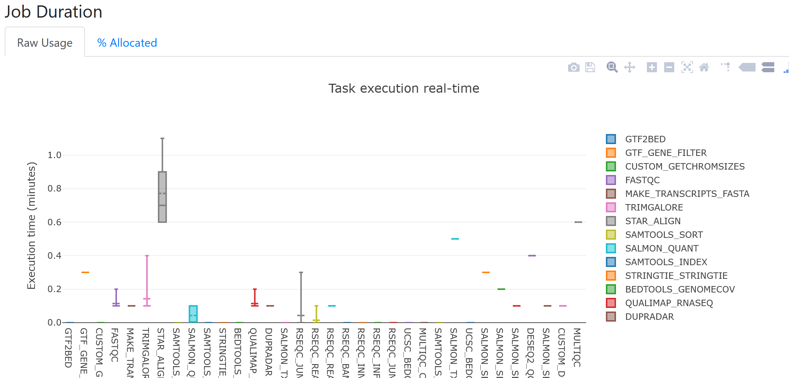
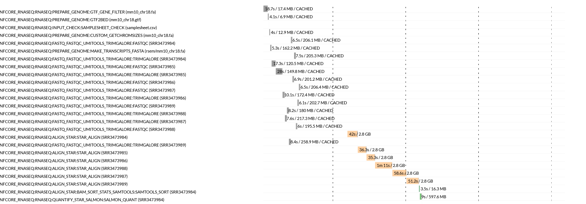

## **Workflow performance reports**

Learning objectives: 
* Learn how to interpret Nextflow workflow execution reports 

# Materials draft 

A number of summary reports are generated by the nf-core/rnaseq pipeline. These include: 

* A MultiQC report summarising all QC tests performed throughout the workflow 
* Nextflow workflow execution reports  

These reports can be useful in evaluating the performance of your workflow execution, both to ensure your methods are accurate and that you are using resources efficiently. 

## **Workflow quality control**

As we process any bioinformatics datasets using a workflow or pipeline, it is important that we document the parameters we have used to execute the workflow and the results at each step. This will ensure our analysis is reproducible by our future selves and others. By tracking the results output by each stage of the workflow, we can track potential issues with out data or the parameters we are using as well as identify things like contamination or biases that may impede our downstream analyses. 

The nf-core/rnaseq pipeline generates comprehensive QC stats for all steps. These metrics are all aggregated into a single report using MultiQC. MultiQC is a popular tool for aggregating quality control metrics output by a number of popular bioinformatics tools. It generates interactive reports and outputs them as `.html` files that can be viewed with a web browser. 

We have previously looked through MultiQC report in this session, but lets take a closer look in this lesson. Open the MultiQC report created at the end of our post-QC pipeline execution. 

```bash
/home/training/Day-1/WBS-mouse-results/multiqc/star_salmon/multiqc_report.html
```

On the left hand side, you will see a number of sections and subsections. The nf-core/rnaseq pipeline runs lots of different tools throughout the workflow to identify possible issues that may affect downstream analysis and summarise the results of each process your sequence data is run through. These are all aggregated here. 

Looking at the table at the top under General Stats, we can see a comparison of various QC metrics across all samples. From this all our samples appear to have consistent high-quality results: 



### Exercise 1: Sample clustering 

In the MultiQC report, open the STAR_SALMON DESeq2 PCA plot using the menu on the left side. Hover your cursor over each point on the scatter plot to identify samples. Reflecting on the case study and our previous alignment exercise, does it appear the samples are clustering as expected? 



We will be looking at sample clustering in more depth in the Day-2 session. 

## **Workflow execution performance**

Nextflow has some inbuilt reporting features that are used by the nf-core/rnaseq pipeline. The nf-core/rnaseq pipeline outputs these reports to the directory we ran the pipeline from (`/home/training/Day-1/WBS-mouse-results/pipeline_info`). The information presented in these reports helps to get an estimate of the required resources for independent processes and assign them for future runs.

nf-core pipelines generate pipeline summary reports by default. View all the outputs in the `pipeline_info` directory: 

```bash
ls -lah 
```
```bash
total 3716
-rw-rw-r-- 1 training training 3383766 Sep 29 03:55 execution_report_2023-09-29_03-40-43.html
-rw-rw-r-- 1 training training  302879 Sep 29 03:55 execution_timeline_2023-09-29_03-40-43.html
-rw-rw-r-- 1 training training   29901 Sep 29 03:55 execution_trace_2023-09-29_03-40-43.txt
-rw-rw-r-- 1 training training   65615 Sep 29 03:55 pipeline_dag_2023-09-29_03-40-43.html
-rw-rw-r-- 1 training training     953 Sep 29 03:40 samplesheet.valid.csv
-rw-rw-r-- 1 training training    1478 Sep 29 03:55 software_versions.yml
```

### Execution report 

Nextflow execution reports are broken down into:

1. Summary: execution status, run command, execution time, other workflow metadata.
2. Resources: plots of disturbution of CPU, RAM usage for each workflow process.
3. Tasks: all tasks executed by the run command, their status, and command run.

As an example, looking at the job duration plot below, it appears STAR was the longest running process for all samples. From the boxplot, we can also see there was quite a bit of variation in runtimes for STAR between samples. 



### Execution timeline 

Nextflow execution timeline files contain bar plots for each process, how long they took to run and the maximum amount of memory consumed. If we look at the STAR task runtimes for each sample in the plot below, we can confirm that the time taken to align reads for each sample ranged from 35 seconds to over a minute. These tasks all also consumed significantly more RAM, than all other processes.  



### Key takeaways 

* Nextflow provides easy to understand html log files, which can be used to understand the system resource requirements.
* Ensuring the reproducibility and accuracy of RNAseq data analyses is crucial and QC metrics should be collected to ensure the success of each step. 
* The nf-core/rnaseq pipeline uses MultiQC to aggregate summary and quality metrics for each step of the pipeline execution.  