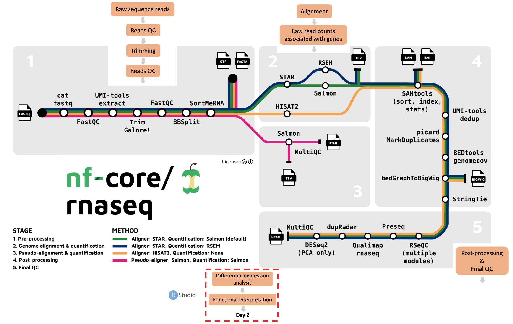

# **Recap of day 1**

<div class="questions">

### **Questions**{.unlisted}
- What stages of the RNA-seq workflow does the nf-core/rnaseq pipeline perform? 
- What were results and files were created by nf-core/rnaseq? 

</div>  
</br>
On day 1 of this workshop series, we used the [nf-core/rnaseq](https://nf-co.re/rnaseq/3.8.1) pipeline to **process raw sequence reads to generate a gene count matrix**. We learned what steps are involved in a typical differential expression RNA-seq workflow. While we **ran the default nf-core/rnaseq pipeline**, we also discussed **how to customise the pipeline's run command** depending on our own needs. Finally, we learned **how to use quality control reports and alignment files** generated by nf-core/rnaseq to evaluate and explore our data.

Given the computational resources and time required to run this pipeline on the mouse genome, we worked only with a subset of the real data. Today, we'll be working with a whole genome count matrix, that has already been prepared. Today's sessions will be a lot more hands on as we explore our gene count data, perform differential expression analysis, and enrichment analysis.



## **What's the plan for day 2?**

We will perform differential expression and enrichment analysis in R/Rstudio, launched from Nimbus. We will use a Singularity container that contains R/Rstudio with pre-installed libraries. We like using containers because they can be shared and run elsewhere, making your analysis **portable** and **reproducible**. 

We'll be using a prepared R markdown file to work through today's activities. You can find at: 

```default
/home/training/base_directory/working_directory/rnaseq_DE_analysis_Day2.Rmd
``` 
