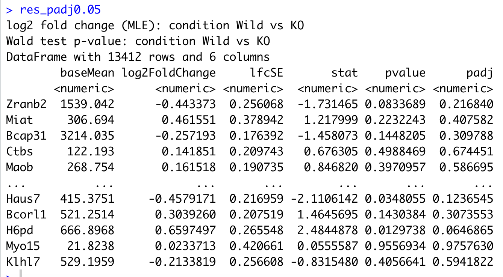
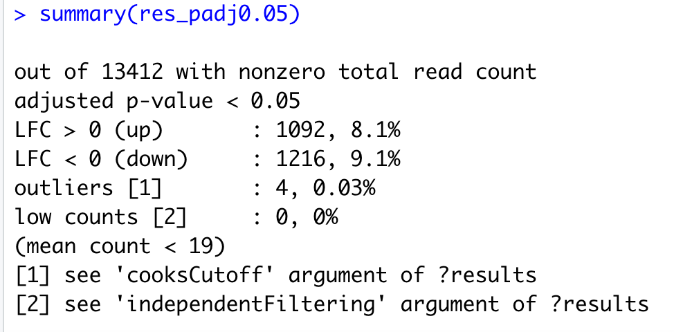

## **Differential expression (DE) analysis using DeSeq2**

<div class="questions">  
### **Questions**
- How to identify statistically significant DE genes?
- How to visualise the results from DeSeq2 analysis?
</div>

<div class="objectives">  
### **Objectives**

- Generate a list of differentially expressed genes.
- Use visualisation techniques to analyse the results.

</div>


#### **The DESeq function**

The standard differential expression analysis steps are wrapped into a single function, `DESeq`. Results tables are generated using the function results, which extracts a results table with log2 fold changes, p values and adjusted p values.
```r
dds <- DESeq(dds)
res <- results(dds)
```
{width=50%}

<br>
```r
# padj 0.05
res_padj0.05<-results(dds,alpha=0.05)
```
{width=70%}

<br>
```r
summary(res_padj0.05)
```
{width=50%}

<br> Write the results to a file
```r
resSig005_subset<-subset(res_padj0.05, padj < 0.05)
write.table(resSig005_subset, "res_FDR0.05.tab", sep="\t", col.names=NA, quote=F)
```

#### **Normalized counts**
To retrieve the normalized counts matrix from dds, we can use the `counts()` function and add the argument `normalized=TRUE`

```r
normalised_counts<-counts(dds,normalized=TRUE)
write.table(normalised_counts, "normalised_counts.tab", sep="\t", col.names=NA, quote=F)
```
<br>***NOTE:** 
<br>DESeq2 doesn’t actually use normalized counts, rather it uses the raw counts and models the normalization inside the `Generalized Linear Model (GLM)`. The normalized counts will be useful for downstream visualization of results, but cannot be used as input to DESeq2


#### **Volcano plot**
- A volcano plot can help us summarise the differential expression of gene for our analysis.
- The y-axis shows -log10(adjusted-p-value) while the X-axis shows logFC of all genes.
- The default colour coding highlights the statistically significant genes and further those with a specific logFC cutoff.


```r
## Merge with normalized count data
resdata <- merge(as.data.frame(res), as.data.frame(counts(dds, normalized=TRUE)), by="row.names", sort=FALSE)
names(resdata)[1] <- "Gene"
head(resdata)

## Volcano plot with "significant" genes labeled
volcanoplot <- function (res, lfcthresh=2, sigthresh=0.05, main="Volcano Plot", legendpos="bottomright", labelsig=TRUE, textcx=1, ...) {
with(res, plot(log2FoldChange, -log10(pvalue), pch=20, main=main, ...))
with(subset(res, padj<sigthresh ), points(log2FoldChange, -log10(pvalue), pch=20, col="red", ...))
with(subset(res, abs(log2FoldChange)>lfcthresh), points(log2FoldChange, -log10(pvalue), pch=20, col="orange", ...))
with(subset(res, padj<sigthresh & abs(log2FoldChange)>lfcthresh), points(log2FoldChange, -log10(pvalue), pch=20, col="green", ...))
if (labelsig) {
require(calibrate)
with(subset(res, padj<sigthresh & abs(log2FoldChange)>lfcthresh), points(log2FoldChange, -log10(pvalue), labs=Gene, cex=textcx, ...))
}
legend(legendpos, xjust=1, yjust=1, legend=c(paste("FDR<",sigthresh,sep=""), paste("|LogFC|>",lfcthresh,sep=""), "both"), pch=20, col=c("red","orange","green"))
}

volcanoplot(resdata, lfcthresh=1, sigthresh=0.05, textcx=.8, xlim=c(-2.3, 2),ylim=c(0, 50))

```


### **Tidy and annotate results**
For the results containing the differentially expressed genes:
Get gene names for ensembl IDs.
Order the gene list by padj value


```r
# https://github.com/stephenturner/annotables
# grch38 comes from library(annotables)
res_tidy.DE = tidy.DESeqResults(resSig005_subset)
res_tidy.DE <- res_tidy.DE %>%
        arrange(p.adjusted) %>%
        inner_join(grcm38, by = c(gene = "symbol")) %>%
        dplyr::select(gene,baseMean, estimate, stderror, statistic, p.value, p.adjusted)
#res_tidy.DE
```

#### **Visualise a few differentially expressed (DE) genes**
```r
dds_orig <- DESeqDataSetFromMatrix(countData = counttable, colData = colData,design = ~condition)

dds_orig <- DESeqDataSetFromMatrix(countData = counttable, colData = colData,design = ~condition)

# IGFBP5
p_site_Sp110<-plotCounts(dds_orig, gene="Sp110", intgroup = "condition", returnData = TRUE) %>%
                ggplot() + aes(dds_orig$condition, count) + 
                geom_boxplot(aes(fill=dds_orig$condition)) + 
                geom_jitter(color="black", size=0.6, alpha=0.9) + 
                scale_y_log10() + theme_bw()+ggtitle("Sp110")+ 
                theme(legend.position = "none")
p_site_Sp110

```

{width=70%} 

```r
# Krt2
p_site_Krt2<-plotCounts(dds, gene="Krt2", intgroup = "condition", returnData = TRUE) %>%
ggplot() + aes(dds$condition, count) + 
                geom_boxplot(aes(fill=dds$condition)) + 
                geom_jitter(color="black", size=0.6, alpha=0.9) + 
                scale_y_log10() + theme_bw()+ggtitle("Krt2")+ 
                theme(legend.position = "none")
p_site_Krt2
```

{width=70%} 


<div class="keypoints">
### **Key points**
- We have used DeSeq2 to identify statistically significant DE genes
</div>  